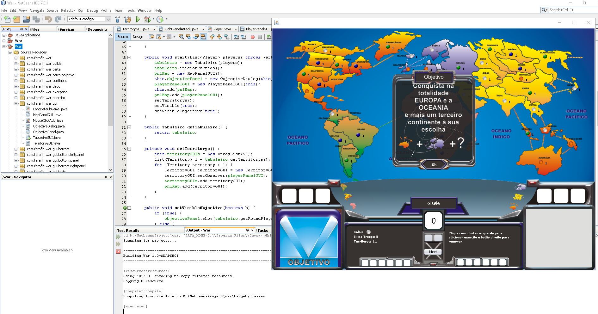

I call this project "Guerra". 
It's a game that I'm developing in Java Swing and there you can learn a little bit more about me 
and how deep is my knowledge in P.O.O. and a little about project patterns as well.

I'm working on this project, so it means that I'm improving some parts in there. :)

As soon as possible I'll share other projects with generic patterns, unit test(Junit), 
Rest (using Jersey) and stuff like that. 
